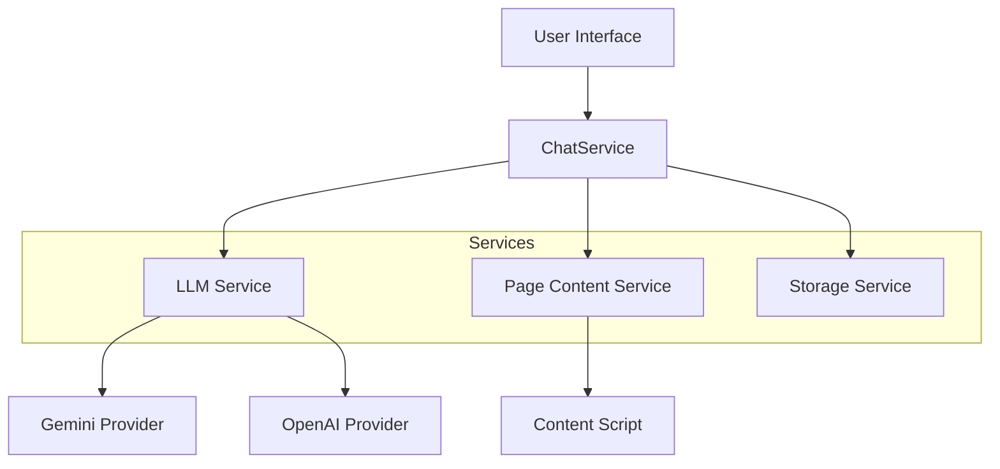

# Requirements: Cross-Browser Chat Extension

## Overview

A cross-browser extension that enables users to chat with the currently open webpage. Users can ask questions, request summaries, and interact with the page content using LLMs (Gemini, OpenAI).

## Core Features

1.  **Chat Interface**: A side-panel or popup interface for chatting.
2.  **Page Context**: Automatically extracts text content from the active tab.
3.  **Summarization**: Built-in capability to summarize the current page.
4.  **Model Selection**: Support for multiple LLM providers (Gemini, OpenAI).
5.  **Settings**: Configuration for API keys and model preferences.

## Technical Architecture

### Tech Stack

- **Framework**: WXT (Web Extension Framework)
- **UI Library**: React + Shadcn UI + Tailwind CSS
- **AI Orchestration**: LangChain.js
- **Streaming**: Vercel AI SDK

### Scalable Service Architecture

The application will use a service-oriented architecture to ensure scalability and ease of adding new capabilities (like MCP in the future).

### Future Considerations

- **Browser MCP**: The `LLMService` and `PageService` should be designed to be exposed as MCP servers or clients in the future.
- **Tools**: The chat agent should be able to use tools (e.g., "Click button", "Scroll").

## UI/UX

- **Design System**: Shadcn UI for a clean, modern, and accessible interface.
- **Theme**: Support for Light/Dark mode, matching the browser or OS.
